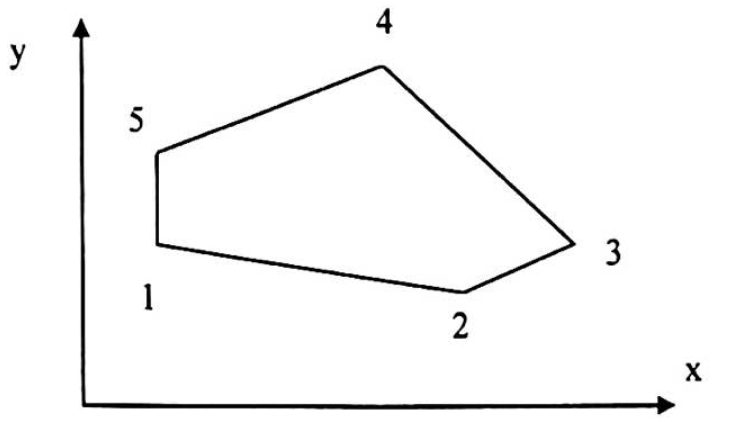
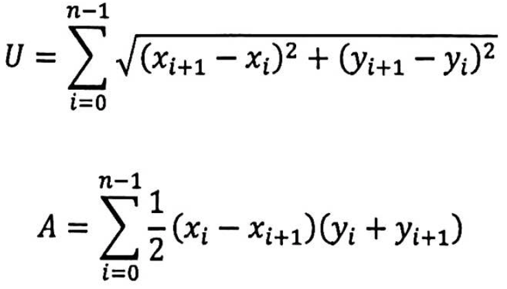

# Polygon calculation ( part 1 )

There is an exemplary Polgon surface with 5 corners in a coordinate system.

In general, the polygon should have n corners.  
The points generally have the coordinates Pi(xi / yi).  
For the following formulas to work, the first point to close the polygon must be saved again in the array.  
In the array, the point with index n is the same point as the point with index 0.  

The circumference and the area of the polygon are then calculated using the following formulas:

Create a program that calculates the bottle and the circumference of a polygon with a maximum of 10 corners.  
At the beginning the user should be asked how many corners the polygon should have.  
The user then enters the x and y coordinates of the points one after the other.  
The polygons should close automatically. Check the program with simple figures.  
